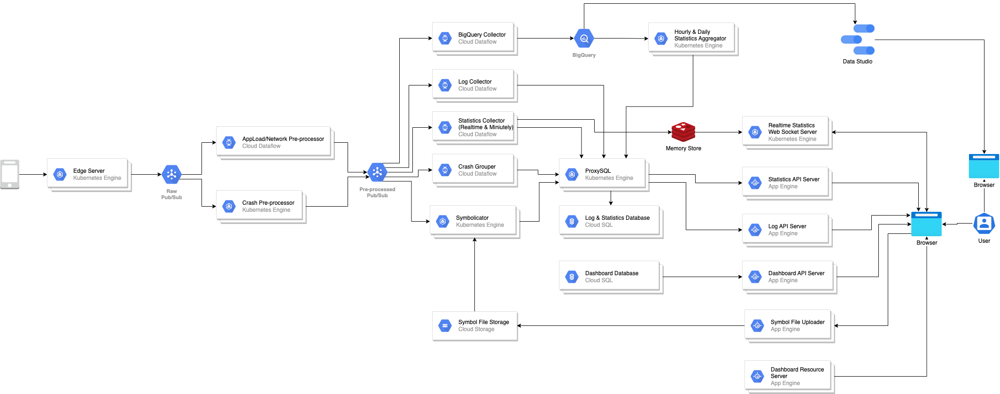

# **시스템 구조 개선 경험 공유**
글로벌 플랫폼팀 
한유진

---

# Index
- 배경
- 목표
- 유지 & 개선 내용
- 느낌점 & 팁

---

# 배경

- 5년동안 사용되고, 운영되어 온 시스템 -> 잦은 담당 조직 이동 -> 방향성 상실
- 수동 업무가 많은 운영 업무, 프로젝트가 더 크기 위한 환경이 필요 
- 운영 : 데이터 추출 업무, 서버 운영 환경 (Kubernetes 미사용, 컨테이너 환경 사용하지 않아 인스턴스 직접 발급받아 환경세팅, DB/NAS(File Server)/Symbolicator 와 같은 물리 장비 세팅과 요청)
    파일 스토리지에 대한 auto-scaling 기능이 없어 수동 관리
- 빅데이터 : DB 샤딩 구조 -> 많은 인스턴스 관리 부담, DB 인스턴스 발급, 세팅, 반납 부담
    DB로 데이터 밸런싱을 수동으로 진행하고 있던 점 -> 이 때문에 새로운 게임이 생길 때마다 직접 DB 용량을 확인 후 마이그레이션
    여러 대의 DB 관리를 위해 Zookeeper 등의 3rd party 서버를 사용, DB 정보를 가져오기 위해 모듈을 만들어 사용
- 레거시 코드 : 대시보드 - 레거시 코드들이 남아있음, 레거시 테이블 등이 많이 남아있음 의미 불명의 테이블들...
    리시버, 콜렉터, 심볼리케이터 - 컴포넌트 별로 역할이 겹치고, 코드가 분산되어 있음 (리시버, 콜렉터에서도 로그를 가공하는 처리 수행, 콜렉터와 심볼리케이터 모두 그룹핑 수행 등)
- 성능 : 대시보드 성능 개선, 집계 방식 개선 (데이터 저장 구조로 인해 집계 추출시 오래 걸리는 점), symbolicator 가 mac에 올려두고 사용중인데 새로운 바이너리 리서치하여 linux 환경에서 동작하도록 수정
- 개발 환경 변경
- GCP 에 익숙하지 않는 경우 힘들 수 있으나 개발, CI/CD 에 유리한 구성 및 컴포넌트들을 가지고 있음 (Composer, Cloud Code, Cloud Repo 등...)
---

# 목표

 시스템 구조와 환경을 변경하여 문제 개선, 운영 인력 감축 및 운영하기 좋은 환경으로 개선

---

# 유지

- 시스템 구조 변경
    - AS-IS, TO-BE 비교
    - AS-IS 그대로 사용한 점: MQ 중앙집중화, DB 수평 샤딩 (앱 별), 데이터 집계 (분단위 같이 자주 발생하는)Streaming 파이프라인 분리, DB 와 Edge 서버 가운데 Collector 를 두어 천천히 insert (처리량 불균형 이슈 해결)
---

# 개선

- 수정한 점: 각 컴포넌트의 수행 역할을 분명히 하고, 역할군에 따라 분리 (리시버, 전처리기, 콜렉터, 그룹퍼, 심볼리케이터), DB 샤딩으로 인한 3rd party 서버와 모듈을 모두 사용하지 않도록 middle ware 인 ProdxySQL 도입, DB 성능 사용하는 시/일 단위 데이터 집계 trigger -> 컴포넌트로 분리, 기존 컴포넌트를 GCP 컴포넌트로 대체하여 운영적 이득 (Dataflow 사용하여 Spark 클러스터 앱, 구성 등의 고려X, Redis -> MemoryStore, Kafka -> PubSub, GCP Storage, DB -> CloudSQL)
- 시스템 환경 변경
    - GCP Kubernetes Engine 사용 -> 모든 컴포넌트 auto-scaling , auto-upgrade 가 가능하여 수동 인스턴스 관리 X
    - GCP 컴포넌트 활용
        - BigQuery 사용 : 데이터 추출 업무 X, 유저가 원하는 입맛대로 DataStudio 등을 사용하여 대시보드 구성도 가능
        - Redis, PubSub, Storage, CloudSQL, Dataflow 사용하여 auto-scaling, 올려두고 크게 신경쓰지 않아도 됨. 운영적 이득
- 개발 환경 변경
    - GCP 에 익숙하지 않는 경우 힘들 수 있으나 개발, CI/CD 에 유리한 구성 및 컴포넌트들을 가지고 있음 (Composer, Cloud Code, Cloud Repo 등...)

---

# 느낌점 & 팁
- 시스템을 전체적으로 개선하려면 시스템에 대한 이해가 높아야하며, 한 번에 이루어지지 않음. 시스템에 맞는 데이터에 맞춰 컴포넌트들을 구성해야하기 때문에 꾸준히 점검해야 하는 듯.
	- 시스템의 문제를 정확하게 인지하고, 이를 해결하기 위한 목표에 오해가 없어야 하는듯
	- 운영 업무가 많은 시스템이라면 다시 한 번 점검해보는 시간을 가지는게 좋을듯. 운영 한번 30분 잡아먹는다고 별일아니라고 생각할 수 있지만 의외로 의지만 있으면 쉽게 문제점을 찾아낼 수 있고, 쉽게 해결될 수도 있음.
		- 시스템 유지를 위해 분기나 6개월에 한번씩은 구조를 자주 리뷰했으면 좋겠음.
	- GCP 에 현재 돌아가고 있음, 혼자 구성하기 매우 편했었음
	- 처음에 컴포넌트 하나하나 익히는데 힘이 들었지만, 가이드가 잘되어있어 이해하기 쉬움
	- Google Cloud 팀에 자문을 구할 수 있는 것이 매우 좋은 팁이 되었었음. 
		- 가이드를 처음부터 끝까지 다 볼 수도, 바로바로 이해하는 것도 힘들기 때문에 지름길을 미리 알려주는 것도 좋은 듯 (정리해둔 위키 걸기)
	- 크래시 리포트 시스템은 symbolicator 나 crash grouper 와 같이 crash 도메인의 특정적인 컴포넌트도 많지만, 사실 대부분의 데이터 파이프라인이 포함된 시스템 구조에서 활용하기 좋은 팁들이 많이 있는 것 같음. 이런 케이스를 같이 공유하고 시스템 아키텍처를 이해하고 또 서로 개선점을 같이 공유해나갈 수 있는 환경이 되었으면 좋겠음

--- 

---

# Appendix 

