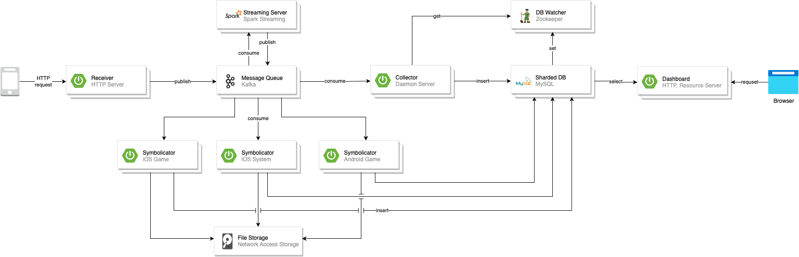

# **시스템 구조 개선 경험 공유**
글로벌 플랫폼팀 
한유진

---

# Index
- 배경
- 목표
- 유지 & 개선 내용
- 느낌점 & 팁

---
*독자들과 보는 관점 등을 설명할 것
*키워드, 중복 단어 없애기, 내용은 어느정도 심기
*좀 어려울 수도 있음

# 배경
- N사의 모든 모바일 게임(약 30종 * android/ios * 지원 국가)의 안정적인 운영을 위한 크래시 리포트 시스템 
  - 모바일 앱에서의 오류 추적 및 성능, 상태를 모니터링하는 시스템
- 당시 약 5년동안 사용되고, 운영
- 게임 론칭 ~ 운영 하면서 필수 플랫폼
  
---

# 배경
- **수동 및 운영 업무**
  - 운영에 필요한 백엔드 인력 최소 3명
  - 개발사별 데이터 추출 업무
  - Auto-scalable 하지 않은 서버 환경
    - DB, NAS(File Storage), Symbolicator 외 다수 인스턴스 발급/반납 
  - 수동 관리가 필요한 DB 샤딩 구조 
    - 수동 샤딩키 발급 -> 게임 론칭 및 클로징 시 직접 마이그레이션
    - 여러 대의 DB 관리를 위해 Zookeeper 서버 사용, DB 정보를 가져오기 위해 모듈을 만들어 사용
---

# 배경
- **레거시 코드**
  - 흩어진 앱 별 예외처리 코드 레거시 코드들이 남아있음, 레거시 테이블 등이 많이 남아있음 의미 불명의 테이블들...
  - 컴포넌트 별로 역할이 겹치고, 코드가 분산되어 있음 (리시버, 콜렉터에서도 로그를 가공하는 처리 수행, 콜렉터와 심볼리케이터 모두 그룹핑 수행 등)
- **성능**
  -대시보드 성능 개선, 집계 방식 개선 (데이터 저장 구조로 인해 집계 추출시 오래 걸리는 점), symbolicator 가 mac에 올려두고 사용중인데 새로운 바이너리 리서치하여 linux 환경에서 동작하도록 수정
- 개발 환경 변경
  - GCP 에 익숙하지 않는 경우 힘들 수 있으나 개발, CI/CD 에 유리한 구성 및 컴포넌트들을 가지고 있음 (Composer, Cloud Code, Cloud Repo 등...)

---

# 목표

시스템 구조와 환경을 변경하여 아래 문제를 개선

**수동 업무 개선**

**운영 인력 감축**

**레거시 코드와 테이블 제거**

**성능 개선**

---

# AS-IS

---

# 교훈과 벤치마킹

1. MQ 중앙집중화
2. 데이터 집계 (분단위 같이 자주 발생하는)Streaming 파이프라인 분리
---

# 유지

3. DB 샤딩 (앱 별)
4. DB 와 Edge 서버 가운데 Collector 를 두어 천천히 insertion (처리량 불균형 이슈 해결)
---

# 개선

---

# 개선

---

# 개선

1. **Component 역할 분리**

- 각 컴포넌트의 수행 역할을 분명히 하고, 역할군에 따라 분리
  - 산재된 중복 코드, 예외처리 코드, 역할을 넘나드는 코드
- Edge Server, Pre-processor, Post-processor(Grouper, Symbolicator, Collector)
---

# 개선
2. **Sharding Key 자동화**
DB 샤딩으로 인한 3rd party 서버와 모듈을 모두 사용하지 않도록 middle ware 인 ProdxySQL 도입

---

# 개선

DB 성능 사용하는 시/일 단위 데이터 집계 trigger -> 컴포넌트로 분리, 기존 컴포넌트를 GCP 컴포넌트로 대체하여 운영적 이득 (Dataflow 사용하여 Spark 클러스터 앱, 구성 등의 고려X, Redis -> MemoryStore, Kafka -> PubSub, GCP Storage, DB -> CloudSQL)
- 시스템 환경 변경
    - GCP Kubernetes Engine 사용 -> 모든 컴포넌트 auto-scaling , auto-upgrade 가 가능하여 수동 인스턴스 관리 X
    - GCP 컴포넌트 활용
        - BigQuery 사용 : 데이터 추출 업무 X, 유저가 원하는 입맛대로 DataStudio 등을 사용하여 대시보드 구성도 가능
        - Redis, PubSub, Storage, CloudSQL, Dataflow 사용하여 auto-scaling, 올려두고 크게 신경쓰지 않아도 됨. 운영적 이득
- 개발 환경 변경
    - GCP 에 익숙하지 않는 경우 힘들 수 있으나 개발, CI/CD 에 유리한 구성 및 컴포넌트들을 가지고 있음 (Composer, Cloud Code, Cloud Repo 등...)
___

# 느낌점 & 팁
- 시스템을 전체적으로 개선하려면 시스템에 대한 이해가 높아야하며, 한 번에 이루어지지 않음. 시스템에 맞는 데이터에 맞춰 컴포넌트들을 구성해야하기 때문에 꾸준히 점검해야 하는 듯.
	- 시스템의 문제를 정확하게 인지하고, 이를 해결하기 위한 목표에 오해가 없어야 하는듯
	- 운영 업무가 많은 시스템이라면 다시 한 번 점검해보는 시간을 가지는게 좋을듯. 운영 한번 30분 잡아먹는다고 별일아니라고 생각할 수 있지만 의외로 의지만 있으면 쉽게 문제점을 찾아낼 수 있고, 쉽게 해결될 수도 있음.
		- 시스템 유지를 위해 분기나 6개월에 한번씩은 구조를 자주 리뷰했으면 좋겠음.
	- GCP 에 현재 돌아가고 있음, 혼자 구성하기 매우 편했었음
	- 처음에 컴포넌트 하나하나 익히는데 힘이 들었지만, 가이드가 잘되어있어 이해하기 쉬움
	- Google Cloud 팀에 자문을 구할 수 있는 것이 매우 좋은 팁이 되었었음. 
		- 가이드를 처음부터 끝까지 다 볼 수도, 바로바로 이해하는 것도 힘들기 때문에 지름길을 미리 알려주는 것도 좋은 듯 (정리해둔 위키 걸기)
	- 크래시 리포트 시스템은 symbolicator 나 crash grouper 와 같이 crash 도메인의 특정적인 컴포넌트도 많지만, 사실 대부분의 데이터 파이프라인이 포함된 시스템 구조에서 활용하기 좋은 팁들이 많이 있는 것 같음. 이런 케이스를 같이 공유하고 시스템 아키텍처를 이해하고 또 서로 개선점을 같이 공유해나갈 수 있는 환경이 되었으면 좋겠음

--- 

# Speical Thanks
- 크래시 리포트 시스템은 초기 설계 및 개발, 운영하시고, 시스템 전체 개선에 도움을 주신 **일환님**

---

# Appendix 
- 크래시 리포트의 A-Z by 일환님 https://highlyscalable.blogspot.com/2023/03/mobile-application-crashreporting.html
