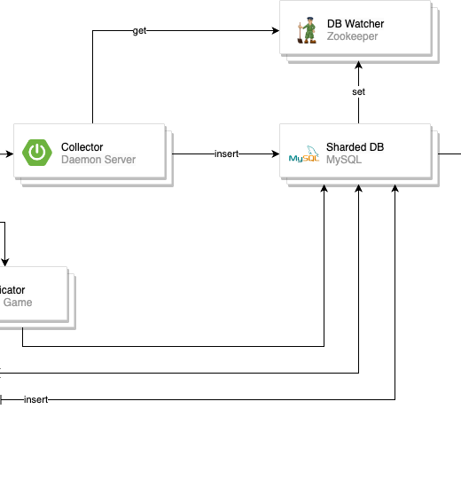

# **시스템 구조 개선 경험 공유**
글로벌 플랫폼팀 
한유진

---
# Index
- 배경
- 목표
- 유지 & 개선 내용
- 느낌점 & 팁

---
# For who?

  
## **서버 개발자**

---
# For what?

  
## 도메인 배제한 **백엔드 아키텍처** 공유
## 난이도 **중상**

---
# 배경
- N사의 모든 모바일 게임(약 30종 * android/ios * 지원 국가)의 안정적인 운영을 위한 시스템
    - 모바일 게임 앱에서의 오류 추적 및 성능, 상태를 모니터링
    - 최소 16,000 ~ 최대 100,000 TPS
    - 당시 약 5년 동안 개발 및 운영
- 잦은 담당 조직 이동 및 운영 인원 축소

---
# 기존

---
# 배경
- **수동 및 운영 업무**
  - 운영에 필요한 백엔드 인력 최소 3명
  - 개발사 별 데이터 추출 업무
  - Auto-scalable 하지 않은 서버 환경
    - Data Store 와 서버 인스턴스 발급/반납 

---
# 배경
- **수동 및 운영 업무** 
  - 수동 관리가 필요한 DB 샤딩 구조 
    - 샤딩키 수동 발급 -> 게임 론칭 및 클로징 시 직접 데이터 마이그레이션
    - 여러 대의 DB 관리를 위해 Zookeeper 서버 운영
    - Zookeeper 로부터 DB 정보를 가져오기 위해 모듈을 만들어 사용
    - 모든 서버 컴포넌트에서 개별 DataSource Connection Pool 관리

---
# 배경
- **레거시 코드와 테이블**
  - 서버 컴포넌트들에 흩어진 앱 별 예외처리 코드, 불필요한 레거시 코드
  - 추가된 기능으로 인해 확장성이 떨어지는 테이블 구조
- **컴포넌트의 불명확한 역할**
  - 컴포넌트 별로 역할이 중복되어 코드가 분산됨

---
# 배경
- **성능**
  - 대시보드 프론트 성능 이슈
  - 데이터 저장 구조로 인해 집계 추출 성능 이슈
  - 데이터 후처리를 위한 컴포넌트가 사용하는 바이너리 성능 및 os 호환성 이슈
    - os 를 mac, linux 로 따로 사용
    - 신규 바이너리 리서치

---
# 목표

시스템 구조와 환경을 변경하여 아래 문제를 개선

**수동 업무 개선**

**레거시 코드와 테이블 제거**

**성능 개선**

**운영 인력 감축**

---
# 교훈과 벤치마킹

1. Message Queue 중앙집중화
2. 데이터 집계 (초/분 단위 같이 자주 발생하는) Streaming 파이프라인 분리

---
# 교훈과 벤치마킹

3. 데이터 특징에 맞게 앱 별 DB 샤딩 
4. DB 와 Edge 서버 가운데 Collector 를 두어 천천히 insertion (처리량 불균형 이슈 해결)

---
# 개선

---
# 개선

---
# 개선

1. **Component 역할 분리**
- 수행 역할에 따라 컴포넌트 분리
  - 산재된 중복 코드, 예외처리 코드, 역할을 넘나드는 코드
- Edge 서버, 전처리기(Pre-processor), 후처리기(Post-processor)

---
# 개선

2. **Sharding Key 자동화**
- 게임 론칭 및 셧다운 시 수동 마이그레이션 불필요
- DB 샤딩으로 인한 3rd party 서버와 모듈을 모두 사용하지 않음
- middle ware 인 ProdxySQL 도입하여 DB 연동
    - 서버 컴포넌트는 모든 개별 DB를 알 필요가 없음

---
# 개선

3. **DB 집계 축소**
- DB 성능 사용하는 시/일 단위 데이터 집계 Trigger -> 컴포넌트로 분리

---
# 개선
4. **Auto-Scalable**
- GCP Kubernetes Engine 사용: 모든 컴포넌트 auto-scaling , auto-upgrade 가 가능하여 수동 인스턴스 관리 X
- MemoryStore, PubSub, Storage, CloudSQL, Dataflow 사용하여 auto-scaling, 올려두고 크게 신경쓰지 않아도 됨
    - Spark, Kafka, Redis 등의 클러스터 관리 X
---
# 개선
5. **GCP 컴포넌트 활용**
- BigQuery, Data Studio 사용
- 필요할 때마다 기간 별로 데이터 추출 X
- 유저가 원하는 입맛대로 DataStudio 등을 사용하여 대시보드 구성도 가능

---
# 결과

---
# 결과
 

## 수동 업무 개선

## 운영 인력 감축

## 대시보드, 집계 성능 개선
  

#### 구글 측에서 매우 칭찬한 아키텍처☺️

---
# 느낌점
- GCP 에 현재 돌아가고 있음, 혼자 구성하기 매우 편했었음
- 운영 업무는 재밌다
- 수동 업무가 30분 잡아 먹는다? 개선 포인트!
- 백엔드 개발자로서 너무 소중했던 경험🌷

---
# 팁
- 전체 개선이 쉽게 이루어졌던 이유는 실시간으로 실서비스 데이터 파이프라인을 연결하여 사용하였기 때문
- 시스템을 전체적으로 개선하려면 시스템에 대한 이해도를 높이자
- 문제, 배경을 정확하게 인지하고 이를 해결하기 위한 목표에 오해가 없어야 한다
- 시스템 유지를 위해 분기나 반기에 한 번씩은 구조를 자주 리뷰하면 좋겠다
- Public Cloud 팀에 자문을 구할 수 있다면 매우 좋다

--- 
# Speical Thanks
- 이 시스템을 초기 설계, 개발 및 운영하시고, 시스템 전체 개선에도 도움을 주신 **일환님**
- 시스템 전체 개선 시 옆에서 도움을 주셨던 전 팀장이셨던 **선영님**
- 이런 좋은 개발 경험을 가질 수 있도록 기회를 선뜻 넘겨주신 **효석님**
  
---
#

  

## Q&A 

---
# Appendix 
- 크래시 리포트의 A-Z by 일환님 https://highlyscalable.blogspot.com/2023/03/mobile-application-crashreporting.html

---
# Appendix 

---
# Appendix 

