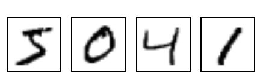

# **Eclipse Deeplearning4j**
한유진

---

# Index
- 배경
- Eclipse Deeplearning4j 란?
- DL4J Stack
- 예제
- Appendix
- 출처

---

# 배경

- 머신러닝 제품의 lifecycle 을 다음과 같이 정의할 수 있음
    - 서로 다른 data source 연결
    - 데이터 클렌징
    - 해당 데이터를 사용하여 신경망 네트워크가 이해할 수 있는 벡터 구축
    - 신경망 네트워크 빌드 및 tuning
    - REST, Spark, 임베디드 환경(Android, Raspberry Pi 등) 에 production 배포
    
---

# 배경

- 딥러닝에서 현재 진행 중인 대부분의 프로젝트는 대기업 애플리케이션과의 하위 호환성에 대해 생각하지 않으며 애플리케이션 구축을 용이하게 하지도 않음
- 대신 유연성과 느슨한 결합을 위해 최적화하여 연구에 용이한 형태로만 제작됨
- real world 애플리케이션과 연구의 중간 다리 역할을 해줄 환경이 필요


---

# Eclipse Deeplearning4j(DL4J) 란?


- [Eclipse Foundation](https://www.eclipse.org/)의 [Eclipse Project](https://projects.eclipse.org/projects/technology.deeplearning4j) 중 하나로 AI가 통합된 애플리케이션을 빌드하는 데에 필수적인 핵심 core 모듈을 제공
- 이를 통해 딥러닝 애플리케이션 구축을 위한 기본값을 제공하는 것이 전반적인 목표
- Eclipse Deeplearning4J (DL4J) eco system은 JVM 기반에서 동작 (Java 뿐 아니라 Scala, Kotlin, Clojure 등의 JVM 기반 언어와 사용 가능)

---

# Eclipse Deeplearning4j(DL4J) 란?

- 원시 데이터로 시작하여, 데이터를 로드하고 전처리하여 다양한 단순하고 복잡한 딥 러닝 네트워크를 구축하고 튜닝할 수 있음
- ETL 라이브러리, tensor 라이브러리 등에 대한 3rd party provider에 의존하지 않고 애플리케이션 구축 프로세스를 용이하게 할 수 있음

---

# DL4J Stack

- **DL4J**
    사용자 정의 계층을 포함하여 다양한 계층으로 MultiLayerNetworks 및 ComputationGraphs를 구축하기 위한 High-level API
    tf.keras 모델을 포함하여 h5(keras for hdfs)에서 Keras 모델 가져오기를 지원하고 Apache Spark에 대한 분산 학습도 지원
- **ND4J**
    500개 이상의 수학, 선형 대수 및 딥 러닝 작업이 포함된 범용 선형 대수 라이브러리 
    OpenBLAS, OneDNN(MKL-DNN), cuDNN, cuBLAS 등과 같은 라이브러리를 통해 CPU 및 GPU(CUDA) 지원 및 가속을 제공하는 최적화된 C++ 코드베이스 LibND4J를 기반으로 함

--- 

# DL4J Stack

- **SameDiff**
    ND4J 라이브러리의 일부인 SameDiff는 자동 차별화/딥 러닝 프레임워크

    SameDiff는 TensorFlow 그래프 모드와 유사한 그래프 기반(정의 후 실행) 방식을 사용 Eager 그래프(TensorFlow 2.x eager/PyTorch)와 같이 그래프 실행이 예정됨

    SameDiff는 TensorFlow 고정 모델 형식 .pb(protobuf) 모델 가져오기를 지원
    
    ONNX, TensorFlow SavedModel 및 Keras 모델에 대한 가져오기가 계획되어 있고, custom layer 및 cost function을 작성할 수 있도록 지원

--- 

# DL4J Stack

- **DataVec**
    다양한 형식과 파일(HDFS, Spark, 이미지, 비디오, 오디오, CSV, Excel 등)의 기계 학습 데이터용 ETL
- **LibND4J**
    모든 것을 뒷받침하는 C++ 라이브러리. (JVM이 기본 배열 및 작업에 액세스하는 방법에 대한 자세한 내용은 JavaCPP를 참조)
- **Python4J**
    JVM 에서 cpython 을 실행하기 위한 번들

---

# 사용 방법
Maven pom.xml
```xml
<dependencies>
  <dependency>
      <groupId>org.deeplearning4j</groupId>
      <artifactId>deeplearning4j-core</artifactId>
      <version>1.0.0-M2.1</version>
  </dependency>
  <dependency>
      <groupId>org.nd4j</groupId>
      <artifactId>nd4j-native-platform</artifactId>
      <version>1.0.0-M2.1</version>
  </dependency>
</dependencies>
```

---

# 예제
- Quick start
1. [Numerical computation](https://github.com/eclipse/deeplearning4j-examples/tree/master/nd4j-ndarray-examples)
2. [Define and train models using a tensorflow/pytorch like interface](https://github.com/eclipse/deeplearning4j-examples/tree/master/samediff-examples)
3. [Model import and deployment](https://github.com/eclipse/deeplearning4j-examples/tree/master/tensorflow-keras-import-examples)
4. [Running models on spark](https://github.com/eclipse/deeplearning4j-examples/tree/master/dl4j-distributed-training-examples)
5. [A small self contained library for running math code](https://github.com/eclipse/deeplearning4j/tree/master/libnd4j)


---

# Model import and deployment


- 유명한 MNIST - Multi Layer Perceptron 문제를 예제로 사용
- 28x28 이미지를 보고 숫자 0~9 까지를 예측하는 문제
- Keras, Tensorflow 에서 구현된 모델을 가져올 수 있음(into SameDiff)
    - 여기서는 tensorflow 모델(.pb)을 가져와 사용

---
# MNIST for java

- Main
```java
    public static void main(String[] args) throws Exception{
        final String dataLocalPath = DownloaderUtility.MODELIMPORT.Download(); // 모델 다운로드
        String modelPath = dataLocalPath + "/tensorflow/frozen_model.pb";
        loadModel(modelPath); // 모델 띄우기
        for(int i = 1; i < 11; i++){
            String file = DownloaderUtility.TFIMPORTEXAMPLES.Download() + "/Mnist/images/img_%d.jpg"; // 이미지 가져오기
            file = String.format(file, i);
            INDArray prediction = predict(file); // 예측
            int label = predictionToLabel(prediction); // 예측 결과 라벨로 변환
            System.out.println(file + "  ===>  " + label);
        }

    }
```
---

# MNIST for java

- 모델 import 
```java
    private static SameDiff sd;
    public static void loadModel(String filepath) throws Exception{
        File file = new File(filepath);
        if (!file.exists()){
            file = new File(filepath);
        }

        sd = TFGraphMapper.importGraph(file); // protobuf 파일로부터 모델 Import              

        if (sd == null) {
            throw new Exception("Error loading model : " + file);
        }
    }
```

---

# MNIST for java

- 데이터 전처리
```java
    public static INDArray predict (String filepath) throws IOException{
        File file = new File(filepath);
        if (!file.exists()){
            file = new File(filepath);
        }

        /* 데이터 전처리 */
        BufferedImage img = ImageIO.read(file);
        double data[] = new double[28 * 28]; // 28x28 이미지 읽고 전처리
        for(int i = 0; i < 28; i++){
            for(int j = 0; j < 28; j++){
                Color color = new Color(img.getRGB(i, j)); // 각 pixel 별 rgb 값 추출                                         
                int r = color.getRed();
                int g = color.getGreen();
                int b = color.getBlue();
                double greyScale = (r + g + b) / 3; // gray 화
                greyScale /= 255.;
                data[i * 28 + j] = greyScale; // gray 화된 픽셀로 덮어씌우기
            }
        }
    ...
```

---
# MNIST for java

- 예측
```java
        INDArray arr = Nd4j.create(data).reshape(-1, 28*28); // Nd4j 용 데이터로 변환
        Map<String,INDArray> placeholder = new HashMap<>();
        placeholder.put("input", arr);

        /* 모델에 넣고 예측 시작 */
        INDArray output = sd.outputSingle(placeholder,"output");
         // 결과 값 0~9 를 가리키는 array 로 변환하고, double vector 로 변환하여 출력
        System.out.println(Arrays.toString(output.reshape(10).toDoubleVector()));
    
        return output;
    }
```

---

# MNIST for java

- 예측 결과 읽기
```java
    public static int predictionToLabel(INDArray prediction){
        // double array 에서 최대값을 가지는 index 가져와서 int 로 변환 > 라벨
        return Nd4j.argMax(prediction.reshape(10)).getInt(0); 
    }
```


---

# Appendix 
- DL4J 에코시스템의 모든 프로젝트는 Windows, Linux 및 macOS를 지원
- 하드웨어 지원에는 CUDA GPU(OSX를 제외한 10.0, 10.1, 10.2), x86 CPU(x86_64, avx2, avx512), ARM CPU(arm, arm64, armhf) 및 PowerPC(ppc64le)가 포함


---
# 출처
- [Github](https://github.com/deeplearning4j/deeplearning4j)
- [Documentation](https://deeplearning4j.konduit.ai/)
